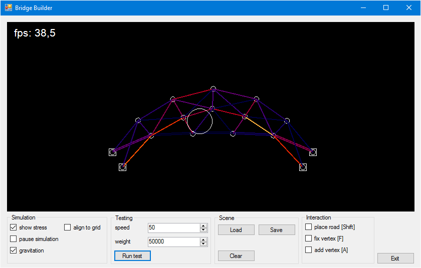
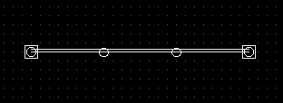
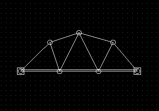

# BridgeBuilder
Bridge builder je hra/hříčka inspirovaná [Bridge Building Game](http://www.bridgebuilder-game.com/). Program simuluje fyziku mostů ve 2D prostředí, umožňuje mosty stavět a testovat s neomezenými konstrukčními možnostmi. Na rozdíl od své předlohy umožňuje stavbu bez zachycování do mřížky s cílem dovolit vytvářet organičtější a zajímavější návrhy.

## Spuštění
Program je vyvíjen v jazyce C#, pro prostředí .NET Framework 4.5.2

## Specifikace
Bridge builder je simulátor stavby mostů, program se skládá ze dvou hlavních částí - stavby a simulace.

Ve stavební části hráč může pomocí jednoduchého rozhraní umisťovat do prostoru pevné body (zastupující zemi), trámy (tedy dva propojené body) a vozovku (trám, na který lze ale aplikovat testovací zátěž). Jednotlivé body se zachycují do mřížky, pro jednodušší ovládání, nicméně tato funkce lze vypnout.

Po návrhu ve stavební části lze přepnout do simulační části, ve které lze myší interagovat s body mostu (aplikovat na ně zátěž), případně most "otestovat", čímž se rozumí nechat po mostu přejet zátěž, která se přesouvá zleva doprava po trámech typu vozovka.

Fyzikální simulace probíhá diskrétně, po časových úsecích, trámy jsou modelovány jako pružiny s vysokou tuhostí.

Při zvoleném pohledu "show stress" lze pozorovat intenzitu zátěže na jednotlivé trámy.

## Ovládání

V horní části okna se nachází simulace, v dolní pak nastavení rozdělená do kategorií, která ovlivňují chod programu.

### Popis nastavení

**Simulation**

- _show stress_: Zapne vizualizaci napětí v trámech pomocí barev. (konkrétně zobrazuje, jak moc je daný trám natažený oproti své klidové délky).
- _pause simulation_: Zastaví simulaci, při spuštění programu je simulace zastavena.
- _gravitation_: Zapne působení gravitační síly v simulaci.
- _align to grid_: Zapne přichytávání do mřížky

**Testing**

- _speed_: Rychlost pohyblivého závaží.
- _weight_: Hmotnost pohyblivého závaží.
- _Run test_: Spustí pohyb závaží po vozovce mostu.

**Scene**

- _Load_: Načte uložený stav simulace.
- _Save_: Uloží aktuální stav simulace.
- _Clear_: Smaže vše z plochy simulace.

**Interaction**

- _place road_: Při zaškrtnutí lze místo umisťování trámů umisťovat vozovku. (také lze držet Shift při umisťování trámů)
- _fix vertex_: Při zaškrtnutí a kliknutí na bod v simulaci tento bod zafixuje.
- _add vertex_: Při zaškrtnutí a kliknutí kamkoli v simulaci umístí nový bod.

### Ovládání myší

Myší lze:
- Rozšiřovat most o další trámy vybráním bodu (kliknutím _levého tlačítka_) a kliknutím na druhý bod v dosahu (přidá trám mezi těmito body) případně kliknutím do prostoru (přidá nový bod a trám).
- Výběr bodu lze zrušit kliknutím _pravého tlačítka myši_.
- Pohybovat body kliknutím a tažením (pokud není vybraný žádný bod).
- Mazat body a trámy najetím a kliknutím _pravého tlačítka myši_.
- Pokud je zaškrtnutý checkbox _place road_, místo trámů se přidávají vozovky.
- Pokud je zaškrtnutý checkbox _fix vertex_, akce _levého tlačítka myši_ je fixování existujících bodů (najetím nad bod a kliknutím)
- Pokud je zaškrtnutý checkbox _add vertex_, akce _levého tlačítka myši_ je přidávání nových bodů.

### První most
Po prvním spuštění bude plocha simulace prázdná. Pro umístění prvního bodu zaškrtněte checkbox _add vertex_ a klikněte kamkoli do černé plochy. Umístí se zde bod, ze kterého lze při stavbě vycházet. Odškrtněte _add vertex_, klikněte na přidaný bod a dalším klikáním mimo rozšiřujte vznikající most. Pro účely návodu vytvořte trojúhelník (levým tlačítkem lze vybrat existující body, a také nové přidávat, pravým tlačítkem zrušíte výběr). Nyní odškrtněte _pause simulation_ pro spuštění simulace, trojúhelník by měl spadnout k zemi. Při spuštěné simulaci nelze přidávat body/trámy, nicméně lze se simulací interagovat. Pomocí myši vezměte trojúhelník a pohybujte s ním po ploše.

Pro stavbu mostů je potřeba umístit do prostoru pevné body, které most bude spojovat. Zastavte tedy simulaci (zaškrtněte _pause simulation_), umístěte nový bod (zaškrtněte _add vertex_, umístěte bod, odškrtněte _add vertex_), umístěte 3 trámy vedle sebe (do přímky) a nyní zaškrtněte _fix vertex_, klikněte na oba krajní body této lávky (měl by se kolem nich objevit čtverec), odškrtněte _fix vertex_. Spusťte simulaci, lávka by měla držet mezi zafixovanými krajními body. Váš první most je hotový.

Pokud bychom chtěli most otestovat (tlačítko _Run test_), narazíme na problém, jelikož lávka se skládá pouze z trámů. Stiskněte tedy tlačítko _Clear_, opakujte předchozí postup vytváření lávky, nicméně při umisťování trámů zaškrtněte _place road_ (případně držte `Shift`). Nyní by se lávka měla skládat z dvojitých čar, které značí vozovku.

Před testováním je dobré si most uložit, klikněte na tlačítko _Save_, pro zajímavější pohled na simulaci zaškrtněte _show stress_ a pak klikněte na _Run test_. Testování probíhá přejezdem závaží (vizualizovaném kruhem, valícím se po vozovce). Zjistíme, že naše lávka se pod zátěží přetrhla.

Naštěstí jsme si most uložili, takže zastavíme aplikaci (_pause simulation_) a klikneme na _Load_. Pomocí trámů se pokuste zpevnit kontrukci mostu tak, aby vydržel zátěž _30000_. Pro inspiraci přikládám obrázek svého řešení.

## Popis chodu programu
### Technologie
Pro zobrazovaní realtime grafiky jsem použil WinForms a použití komponenty `pictureBox`. I když je tento způsob pomalejší a renderování probíhá na CPU, pro potřeby velmi jednoduché vizualizace naprosto stačí a má tu výhodu, že lze spustit i na platformě [Mono](http://www.mono-project.com/).

### Rendering
Program v rendering threadu (funkce [`RenderLoop`](https://github.com/kukas/BridgeBuilder/blob/2956d081146e3d865e9263ba13ff07507e522466/BridgeBuilder/BridgeBuilderForm.cs#L72)) v pravidelných intervalech překresluje `Bitmap`, který zobrazuje `pictureBox` v okně aplikace. Pro samotné renderování jsem musel zajistit vlastní double buffering (třída `DoubleBuffer`) pro eliminaci blikání při překreslování snímků a také vlastní časovač, který stabilizuje počet snímků za sekundu na nastavenou hodnotu (třída `FpsMeter`).

Vykreslování zajišťují třídy [`*Renderer`](https://github.com/kukas/BridgeBuilder/tree/master/BridgeBuilder/Renderers), které pro jednotlivé části programu (simulace, interakce, testování) vykreslují danou vrstvu zobrazení. 
Implementace vykreslování je již přímočará, za použití třídy `Graphics`, která poskytuje metody pro kreslení primitivních tvarů.

### Simulace
Jelikož simulace pro vyšší stabilitu a přesnost musí probíhat v jemnějších časových intervalech než vykreslování, probíhá v jiném threadu ([`UpdateLoop`](https://github.com/kukas/BridgeBuilder/blob/c9ef86ed065c0c48d491690e35676194db6715fc/BridgeBuilder/BridgeBuilderForm.cs#L114)), který si časování zajišťuje nezávisle na rendering threadu. Toto je také z mé zkušenosti běžná praxe. Jelikož jsou některé konstanty simulace částečně závislé na délce simulovaného časového úseku, je nutné simulovat vždy pevně daný čas, v případě mého simulátoru 4ms. Pokud thread čekal déle, simulace se spustí několikrát, aby dohnala reálný čas.

Simulace využívá [Verletovy metody integrace bez rychlostí](https://en.wikipedia.org/wiki/Verlet_integration#Verlet_integration_.28without_velocities.29), která má tu výhodu, že jsou v ní stabilní nekonečně tuhé pružiny, které dobře modelují trámy mostů. Pro reálnou aplikaci by bylo nutné implementovat některou metodu konečných prvků, pro mé účely ale jednoduchá simulace stačí. Původně jsem experimentoval s [Eulerovou (naivní) metodou](https://en.wikipedia.org/wiki/Euler_method) a s [RK4 metodou](https://en.wikipedia.org/wiki/Runge%E2%80%93Kutta_methods#The_Runge.E2.80.93Kutta_method), obě ale při nastavení vyšší tuhosti vedly k velmi nestabilním simulacím. Implementace simulace je ve třídách [`Edge`, `Vertex` a `Simulation`](https://github.com/kukas/BridgeBuilder/tree/c9ef86ed065c0c48d491690e35676194db6715fc/BridgeBuilder/Simulation), konkrétně `Simulation` udržuje celý stav simulace (který lze i ukládat a načítat ze souboru), stará se o přidávání a odebírání bodů, `Vertex` udržuje stav jednotlivých bodů a zajišťuje jejich pohyb a aplikaci sil, `Edge` vynucuje stálé vzdálenosti mezi propojenými body.

Seznam bodů a trámů v simulaci je nutné udržovat v `ConcurrentBag`, kvůli interakci tří různých threadů (`SimulationRenderer` z tohoto seznamu čte a `Interaction` naopak volá metody, které do seznamu přidávají nové prvky, `Simulation` čte i zapisuje)

### Interakce
Logiku interakce uživatele se stavem simulace jsem měl původně implementovanou přímo v třídě `Simulation`, jak jsem ale přidával další možnosti interakce, simulace začala zastávat příliš mnoho funkcí programu. Po vzoru MVC architektur jsem tedy interakci odčlenil do zvláštní třídy `Interaction`. Na rozdíl od renderování a simulace tato třída nemá svůj vlastní thread, jelikož její metody volají event handlery myši a klávesnice - jednoduše řečeno se tedy tato třída stará o všechna klikání na plochu simulace. Obsahuje svou podtřídu `VertexConnector`, která zajišťuje dvoufázové spojování bodů - jedním kliknutím bod vybere, druhým spojí s dalším.

Krom interakce simulace s myší jsou v aplikaci i tlačítka, checkboxy a číselné vstupy, nicméně na obsluhu všech stačilo buď registrovat vhodné data bindingy, případně šlo o několika řádkové funkce, které se vešly do třídy `BridgeBuilderForm`

Mezi interakci počítám i testování mostu, to zajišťuje třída `TestingStress`. Ta funguje velmi jednoduše - při zahájení testování nalezne v simulaci hranu, která je vozovka a zároveň má nejlevější bod na scéně. Na tomto bodu se závaží začne valit po hraně. Jakmile narazí na konec hrany, hledá další hranu, která navazuje na předchozí. Jakmile takovou nenalezne, závaží dojelo na konec vozovky.
